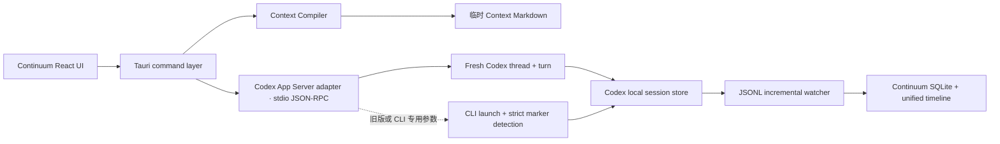

# 在 ChatGPT Codex 客户端能力之上开发

更新日期：2026-08-01  
本机验证版本：`codex-cli 0.146.0` / `Codex Desktop/0.146.0`

## 结论

Continuum 不应修改或注入 ChatGPT/Codex 官方桌面应用本体。官方为自建富客户端提供的深度集成边界是 **Codex App Server**：它提供认证、会话历史、审批和流式 Agent 事件，并且正是 Codex 富客户端使用的接口。Continuum 应作为独立 Tauri 客户端，通过本机 `codex app-server` 与 Codex 通信。

官方资料：

- [Codex App Server](https://learn.chatgpt.com/docs/app-server.md)
- [Codex CLI reference](https://developers.openai.com/codex/cli/reference)
- [Codex open source repository](https://github.com/openai/codex/tree/main/codex-rs/app-server)

## 已在本机验证的事实

1. `codex --version` 返回 `codex-cli 0.146.0`。
2. `codex app-server --help` 存在，并支持 `stdio://`、WebSocket 和 Unix socket；其中 WebSocket 仍标记为实验性且不受支持。
3. `codex app-server generate-json-schema --out <DIR>` 成功生成当前安装版本的 v1/v2 JSON Schema。
4. 通过 `stdio://` 发送 `initialize` 后，本机返回：

   ```text
   Codex Desktop/0.146.0 ... (continuum_probe; 0.1.0-alpha.1)
   ```

5. 当前 v2 Schema 确认 `thread/start` 支持 `cwd`、`model`、`approvalPolicy`、`sandbox` 和 `serviceName`；`turn/start` 支持文本输入并要求明确的 `threadId`。

这些是对当前安装环境的实测，不代表未来版本永远保持完全相同的字段。构建和发布时应使用目标 Codex 版本重新生成 Schema，并执行协议探针。

## 对 Continuum 的推荐架构



主路径使用 App Server，原因是 `thread/start` 直接返回新 thread ID，不需要猜测“最新会话文件”。本地 JSONL 扫描仍然有价值：它是重启恢复、历史导入、兼容旧版本以及独立校验的持久化后备。

## Fresh Continuation 的正确协议映射

1. Continuum 在 SQLite 中先创建 Continuation 记录并编译 Context Snapshot。
2. 把长上下文写入项目内临时 Markdown 文件，记录 SHA-256。
3. 启动 `codex app-server --listen stdio://`。
4. 发送一次 `initialize`，`clientInfo.name` 使用 `continuum`；随后发送 `initialized`。
5. 调用 `thread/start`，传入显式 `cwd`、Profile 的 model/approval/sandbox，并保持 `ephemeral=false`。
6. 直接读取响应中的 `thread.id`，立即绑定到统一项目和原分支。
7. 调用 `turn/start`，首条文本只包含唯一 `CONTINUATION_ID`、上下文文件路径和核对工作区的指令。
8. 继续读取通知；同时监听本地会话存储并增量导入，以 SQLite 时间线作为产品的持久视图。

Fresh 不应调用：

- `thread/resume`：它继续旧 thread。
- `thread/fork`：它复制旧历史形成分叉。
- `thread/compact/start`：它压缩的是现有 thread，而不是创建只含 Continuum 编译上下文的干净 thread。
- `thread/inject_items`：这是更底层的历史注入接口，当前需求用“上下文文件 + 一条短用户提示”更容易审计、跨版本也更稳健。

## 稳定性与安全边界

- 使用本地 `stdio://`；不要为本机桌面客户端暴露无认证的非回环 WebSocket。
- 在发送任何请求前完成 initialize/initialized 握手。
- 为请求 ID、响应超时、JSON 解析失败和进程退出分别记录错误码。
- App Server 能力检测成功后才启用主路径；旧版 Codex 回退到现有 CLI + marker + cwd + createdAt 多条件识别。
- Profile 含无法映射到协议字段的 CLI 启动参数时，必须走 CLI 后备，不能静默丢弃参数。
- 当前 P0 App Server 主路径仅用于显式 `approvalMode=never` 的 Profile；`on-request`/`untrusted` 在 Continuum 完成审批请求 UI 与响应协议前继续走原生 CLI，避免后台会话无响应地停在审批请求上。
- 不把长上下文放到命令行；仍通过临时 Markdown 文件传递。
- `clientInfo.name` 会进入合规日志。面向企业正式发布前，应按官方说明联系 OpenAI 登记已知客户端标识。
- 只使用稳定方法；需要 `experimentalApi` 的方法必须单独加能力开关，不能成为 P0 主链路依赖。

## 在 Codex 客户端中开发 Continuum 的工作方式

“在 Codex 客户端中开发”适合分成三层：

1. 当前任务提示：只放本轮目标、边界和验收。
2. 仓库 `AGENTS.md` 与 `.codex/config.toml`：放长期工程约定、验证命令、沙箱/MCP/Hook 配置。
3. 可复用 Skill/Plugin/MCP：放可安装工作流或外部数据与动作。

不要通过修改 Codex 安装目录或依赖桌面 UI 控件位置实现产品能力。Continuum 的稳定接口应是 App Server、CLI 能力检测和公开的本地会话持久化格式；桌面 UI 自动化只能用于端到端冒烟测试。

## 已落实到代码的改动

- 新增 `codex_app_server` Rust 适配器，使用 stdio JSON-RPC 完成握手、`thread/start` 和 `turn/start`。
- Fresh Continuation 在能力允许且 Profile 无需客户端审批响应时优先使用 App Server，直接绑定返回的 thread ID。
- 原 CLI 启动与严格本地会话识别保留为后备。
- Diagnostics 增加 App Server 能力显示与无副作用握手探针。
- Codex Profile 显示 App Server 能力；CLI 专用参数会阻止无损映射并使用后备路径。
- 2026-08-01 的隔离只读真实验收已覆盖新 thread ID、真实 JSONL、assistant 增量消息与数据库重开持久化；证据见 `fresh-continuation-acceptance-2026-08-01.md`。

## 后续实现优先级

1. 把 App Server 通知流接入统一的增量事件队列，JSONL watcher 负责去重与持久化校验。
2. 在应用退出时管理 App Server 子进程，在重启后恢复为“已绑定、等待本地持久化同步”。
3. 发布构建中生成并保存目标 Codex 版本的协议 Schema Hash，启动时对比本机版本。
4. 增加 fake app-server 集成测试，覆盖响应乱序、错误响应、超时、进程退出和重复 thread ID。
5. 只在明确需要时评估审批请求的客户端响应；P0 默认沿用 Codex Profile 的审批策略。
